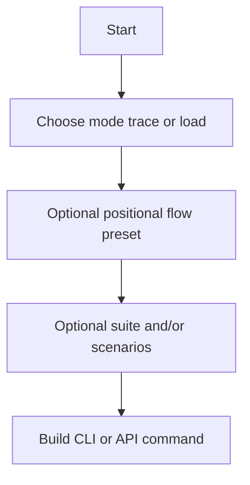

# Simulator capabilities reference

Exhaustive catalog of **flows**, **modes**, **suites**, **scenarios**, **CLI flags**, **run-plan JSON**, **environment variables**, and **web/API run fields** for the Fainzy order simulator. For narrative operations, health vocabulary, and screen-by-screen UI semantics, use [SIMULATOR_GUIDE.md](../SIMULATOR_GUIDE.md). For component responsibilities and architecture, use [ARCHITECTURE.md](../ARCHITECTURE.md).

**Configuration precedence:** explicit CLI flags → selected plan JSON → `.env` → built-in defaults (see [SIMULATOR_GUIDE.md](../SIMULATOR_GUIDE.md) §1 Inputs and Outputs).

**Maintenance:** When adding flows, scenarios, flags, or plan keys, update this file from the modules listed in [§ Source of truth](#source-of-truth). Last verified against repository sources: `flow_presets.py`, `scenarios.py`, `__main__.py`, `config.py` (`apply_plan_defaults`), `run_plan.py`, `interaction_catalog.py`, `api/app/runs/models.py`, `api/app/main.py` (`_build_command`, `_flows_payload`).

---

## Table of contents

1. [Execution model](#execution-model)
2. [Decision flow (high level)](#decision-flow-high-level)
3. [Modes](#modes)
4. [Named flows (CLI positional `flow`)](#named-flows-cli-positional-flow)
5. [Flow aliases](#flow-aliases)
6. [Optional flags by mode (`flow_capabilities`)](#optional-flags-by-mode-flow_capabilities)
7. [API: `GET /api/v1/flows`](#api-get-apiv1flows)
8. [Trace suites](#trace-suites)
9. [Trace scenarios](#trace-scenarios)
10. [Timing profiles](#timing-profiles)
11. [CLI reference](#cli-reference)
12. [Stripe and coupon guardrails (`_validate_config`)](#stripe-and-coupon-guardrails-_validate_config)
13. [Run plan JSON](#run-plan-json)
14. [Environment variables (`config.py`)](#environment-variables-configpy)
15. [Web/API: `RunCreateRequest` → CLI](#webapi-runcreaterequest--cli)
16. [API validation (run create)](#api-validation-run-create)
17. [Related utilities](#related-utilities)
18. [Source of truth](#source-of-truth)

---

## Execution model

| Mode | Entry | Purpose |
|------|--------|---------|
| `trace` | `trace_runner.run` | Deterministic scenarios; bootstraps auth/fixtures; step-by-step polling; optional passive `WebsocketObserver` when order-driving scenarios are included |
| `load` | `__main__._run_load_mode` | Concurrent user workers, store listeners, robot listeners; bounded or `--continuous` |

**Artifacts (each run):** under `runs/<timestamp>/` — `events.json`, `report.md`, `story.md`.

**Plans:** `users[]` and `stores[]` scope `--phone`, `--store`, and env-derived user/store selection; out-of-plan values fail fast. Invalid selected plan falls back to repo `sim_actors.json` with warning unless strict validation fails both.

---

## Decision flow (high level)

- **Suite + scenarios:** `resolve_trace_scenarios` expands the suite, appends explicit `--scenario` values, **dedupes** while preserving order, and if nothing remains uses suite **`core`**.

---

## Modes

| Value | Meaning |
|-------|---------|
| `trace` | Run ordered list of trace scenarios (suite and/or `--scenario`) |
| `load` | Multi-actor load; uses `--users`, `--orders`, `--interval`, `--reject`, `--continuous` |

Constraints: `--continuous` only in `load`. Trace cannot combine with load-only numeric knobs; load cannot use trace `suite` / `scenarios` (enforced in API `_build_command` validation).

---

## Named flows (CLI positional `flow`)

Each row is a key in `FLOW_PRESETS`. Passing this as the first positional argument applies the preset **after** base argparse defaults; preset overrides `SIM_RUN_MODE`, and either `SIM_TRACE_SUITE` **or** `SIM_TRACE_SCENARIOS`, plus any listed payment / `post_order_actions` / `user_role` fields via `__main__._apply_args` → `resolve_flow`.

| Flow | Mode | Default suite | Default scenarios | Other preset fields |
|------|------|---------------|-------------------|----------------------|
| `load` | load | — | — | — |
| `menus` | trace | `menus` | — | — |
| `new-user` | trace | — | `new_user_setup` | `user_role`: `new_user` |
| `paid-no-coupon` | trace | — | `returning_paid_no_coupon` | `payment_mode`: stripe, `payment_case`: paid_no_coupon, `coupon_id`: null |
| `paid-coupon` | trace | — | `returning_paid_with_coupon` | `payment_mode`: stripe, `payment_case`: paid_with_coupon; preset also sets `coupon_required` in data (operators still need coupon id or auto-select) |
| `free-coupon` | trace | — | `returning_free_with_coupon` | `payment_mode`: free, `payment_case`: free_with_coupon, `free_order_amount`: 0.0; `coupon_required` in preset data |
| `store-setup` | trace | — | `store_first_setup` | — |
| `store-accept` | trace | — | `store_accept` | stripe / paid_no_coupon / `coupon_id`: null |
| `store-reject` | trace | — | `store_reject` | — |
| `robot-complete` | trace | — | `robot_complete` | stripe / paid_no_coupon / `coupon_id`: null |
| `payments` | trace | `payments` | — | — |
| `audit` | trace | `audit` | — | — |
| `doctor` | trace | `doctor` | — | — |
| `full` | trace | `full` | — | — |
| `receipt-review` | trace | — | `receipt_review_reorder` | stripe / paid_no_coupon, `post_order_actions`: true |
| `store-dashboard` | trace | — | `store_dashboard` | — |

---

## Flow aliases

Passing an alias normalizes to the canonical preset name (`normalise_flow` → `FLOW_ALIASES`):

| Alias | Resolves to |
|-------|-------------|
| `paid` | `paid-no-coupon` |
| `coupon` | `paid-coupon` |
| `free` | `free-coupon` |
| `new_user` | `new-user` |
| `store_setup` | `store-setup` |
| `store_accept` | `store-accept` |
| `store_reject` | `store-reject` |
| `robot` | `robot-complete` |
| `daily` | `doctor` |
| `doctor` | `doctor` |
| `receipt_review` | `receipt-review` |
| `receipt-review-reorder` | `receipt-review` |
| `dashboard` | `store-dashboard` |

Hyphens vs underscores: keys are normalized with `.lower().replace("_", "-")` before alias lookup.

---

## Optional flags by mode (`flow_capabilities`)

`allowed_optional_flags` per resolved mode (from `FLOW_OPTIONAL_FLAGS`):

**Trace:** `timing`, `store_id`, `phone`, `suite`, `scenarios`, `strict_plan`, `skip_app_probes`, `skip_store_dashboard_probes`, `no_auto_provision`, `enforce_websocket_gates`, `post_order_actions`, `all_users`, `extra_args`

**Load:** `timing`, `store_id`, `phone`, `all_users`, `users`, `orders`, `interval`, `reject`, `continuous`, `strict_plan`, `skip_app_probes`, `skip_store_dashboard_probes`, `no_auto_provision`, `enforce_websocket_gates`, `post_order_actions`, `extra_args`

Note: CLI uses `--store` and `--phone` (not `store_id`). Web API uses `store_id` / `phone` field names.

For trace, **`available_suites`** = all keys of `TRACE_SUITES`; **`available_scenarios`** = full `TRACE_SCENARIOS` tuple.

---

## API: `GET /api/v1/flows`

Response shape (`_flows_payload`):

- **`flows`:** sorted keys of `FLOW_PRESETS`
- **`capabilities`:** map `flow_name` → object with:
  - `flow`, `resolved_mode`, `default_suite`, `default_scenarios`
  - `allowed_optional_flags`
  - `available_suites` (trace only; else `[]`)
  - `available_scenarios` (trace only; else `[]`)

The Runs UI uses this to show only valid inputs for the selected flow/mode context.

---

## Trace suites

Order matches `TRACE_SUITES` definition in `scenarios.py` (execution order for suite expansion).

### `core`

`completed`, `rejected`, `cancelled`

### `payments`

`returning_paid_no_coupon`, `returning_paid_with_coupon`, `returning_free_with_coupon`

### `menus`

`menu_available`, `menu_unavailable`, `menu_sold_out`, `menu_store_closed`

### `store`

`store_first_setup`, `store_accept`, `store_reject`

### `audit`

`app_bootstrap`, `new_user_setup`, `store_first_setup`, `store_dashboard`, `menu_available`, `menu_unavailable`, `menu_sold_out`, `menu_store_closed`, `returning_paid_no_coupon`, `returning_paid_with_coupon`, `returning_free_with_coupon`, `store_accept`, `store_reject`, `robot_complete`, `receipt_review_reorder`

### `doctor`

`app_bootstrap`, `store_first_setup`, `store_dashboard`, `menu_available`, `menu_unavailable`, `menu_sold_out`, `menu_store_closed`, `returning_paid_no_coupon`, `store_accept`, `store_reject`, `robot_complete`, `receipt_review_reorder`

### `full`

`app_bootstrap`, `new_user_setup`, `store_first_setup`, `store_dashboard`, `menu_available`, `menu_unavailable`, `menu_sold_out`, `menu_store_closed`, `returning_paid_no_coupon`, `returning_paid_with_coupon`, `returning_free_with_coupon`, `store_accept`, `store_reject`, `robot_complete`, `receipt_review_reorder`

---

## Trace scenarios

All names must appear in `TRACE_SCENARIOS`. Unsupported names raise at resolve time.

| Scenario | Intent / behavior |
|----------|-------------------|
| `completed` | Full happy path: place order, payment, store ready path, robot lifecycle to `completed` (`_run_completed`). |
| `rejected` | Store rejects before payment; expect terminal `rejected`. |
| `cancelled` | Customer cancels while pending. |
| `auto_cancel` | Waits for backend timeout cancellation without store action (timing profile sets wait duration). |
| `new_user_setup` | Validates new-user bootstrap path; user auth uses `scenario=bootstrap` hint when present in list. |
| `returning_paid_no_coupon` | Paid Stripe path without coupon (`_run_payment_scenario`). |
| `returning_paid_with_coupon` | Paid Stripe path with coupon (`_run_payment_scenario`). |
| `returning_free_with_coupon` | Free-order path with coupon (`_run_payment_scenario`). |
| `menu_available` | Asserts user-facing menu gate with status available, store open (`_run_menu_status_probe`). |
| `menu_unavailable` | Menu status unavailable, store open. |
| `menu_sold_out` | Menu sold out, store open. |
| `menu_store_closed` | Menu available but store treated as closed for probe. |
| `store_first_setup` | Runs store first-time setup flow when not already satisfied in bootstrap (`_run_store_first_setup`). |
| `store_accept` | Same completion machinery as happy path but scenario label `store_accept`. |
| `store_reject` | Same reject machinery with scenario label `store_reject`. |
| `robot_complete` | Happy path with scenario label `robot_complete` (robot completion focus). |
| `app_bootstrap` | User app probes: config, product auth, pricing, cards, coupons, active orders (`_run_app_bootstrap`). |
| `store_dashboard` | Store dashboard probes: orders / statistics / top customers (`_run_store_dashboard`). |
| `receipt_review_reorder` | Forces `SIM_RUN_POST_ORDER_ACTIONS` on for the scenario block, runs completed path plus receipt/review/reorder checks. |

**Fixture-heavy scenarios** (`FIXTURE_REQUIRED_SCENARIOS` in `trace_runner.py`): includes all order/payment/menu paths above except `store_dashboard` and `store_first_setup` (which has its own bootstrap path). Used to decide store preflight / fixture bootstrap behavior.

**Websocket observer:** Started when the resolved list contains any of: `completed`, `rejected`, `cancelled`, `auto_cancel`, `returning_paid_no_coupon`, `returning_paid_with_coupon`, `returning_free_with_coupon`, `store_accept`, `store_reject`, `robot_complete`, `receipt_review_reorder`.

---

## Timing profiles

| Profile | `store_decision_delay` | `store_prep_delay` | `auto_cancel_wait_seconds` | Robot step delays (summary) |
|---------|------------------------|--------------------|------------------------------|------------------------------|
| `fast` | 0.2–0.5 s | 0.2–0.5 s | 30 | ~0.2–0.6 s per robot status step |
| `realistic` | 3–12 s | 20–90 s | 180 | tens of seconds per robot step |

Robot statuses configured: `enroute_pickup`, `robot_arrived_for_pickup`, `enroute_delivery`, `robot_arrived_for_delivery`, `completed`.

---

## CLI reference

Invocation: `python3 __main__.py …` from the repo root (same entry as `python3 -m simulate` when that package invocation is wired on `PYTHONPATH`). Docker and the web API spawn the same argv shape. Built-in `--help` still mentions `sim_actors.json` for `--phone` / `--store`; values must exist in whatever plan `--plan` selects (`sim_actors.json`, `runs/gui-plans/*.json`, etc.).

| Argument | Type | Default / notes |
|----------|------|-----------------|
| `flow` | optional positional | Named preset; if omitted and `--mode` / `--suite` / `--scenario` not in argv, defaults to `config.SIM_FLOW` from env/plan |
| `--mode` | `load` \| `trace` | `SIM_RUN_MODE` (default `load` from env) |
| `--suite` | string | `SIM_TRACE_SUITE` (default `core`); trace only |
| `--scenario` | repeatable | Adds scenarios; trace only |
| `--timing` | `fast` \| `realistic` | `SIM_TIMING_PROFILE` |
| `--users` | int | Load only; default `N_USERS` |
| `--interval` | float | Load only; seconds between orders |
| `--reject` | float | Load only; 0.0–1.0 reject probability |
| `--orders` | int | Load only; bounded total orders |
| `--continuous` | flag | Load only; run until interrupted |
| `--phone` | string | Must be in plan `users[]` |
| `--store` | string | Must be in plan `stores[]` |
| `--all-users` | flag | Auth all plan users (load path) |
| `--plan` | path | JSON run plan |
| `--strict-plan` | flag | Strict plan validation (users/stores GPS etc. per `RunPlan.validate`) |
| `--skip-app-probes` | flag | Sets `SIM_RUN_APP_PROBES` false |
| `--skip-store-dashboard-probes` | flag | Sets `SIM_RUN_STORE_DASHBOARD_PROBES` false |
| `--post-order-actions` | flag | Sets `SIM_RUN_POST_ORDER_ACTIONS` true |
| `--enforce-websocket-gates` | flag (mutex group) | Fail fast on gate failures |
| `--no-enforce-websocket-gates` | flag (mutex group) | Continue with warnings |
| `--no-auto-provision` | flag | Sets `SIM_AUTO_PROVISION_FIXTURES` false |

**Websocket flags:** Default in argparse is `None`; only explicit CLI sets `SIM_ENFORCE_WEBSOCKET_GATES`. Otherwise env/plan applies.

**Explicit CLI wins:** `_explicit_config_overrides` + per-flag `if _has_cli_flag` ensures plan does not overwrite explicit CLI for mapped options.

---

## Stripe and coupon guardrails (`_validate_config`)

| Rule | Condition |
|------|-----------|
| Stripe key | If `SIM_PAYMENT_MODE=stripe` and (`SIM_RUN_MODE=load` **or** trace list contains any of `completed`, `returning_paid_no_coupon`, `returning_paid_with_coupon`, `store_accept`, `robot_complete`, `receipt_review_reorder`), then `STRIPE_SECRET_KEY` is required |
| Free amount | If `SIM_PAYMENT_MODE=free`, `SIM_FREE_ORDER_AMOUNT` must be ≤ 0 |
| Coupon | If trace includes `returning_paid_with_coupon` or `returning_free_with_coupon`, need `SIM_COUPON_ID` **or** `SIM_AUTO_SELECT_COUPON=true` |
| Reject rate | `0 <= REJECT_RATE <= 1` |
| Load bounds | `N_USERS >= 1`, `SIM_ORDERS >= 1` in load mode |
| Continuous + trace | Forbidden |

---

## Run plan JSON

Top-level sections (`RunPlan`):

| Section | Role |
|---------|------|
| `schema_version` | int, default 1 |
| `name` | Optional plan display name |
| `defaults` | Actor defaults merged by `apply_actor_selection`: `user_phone`, `store_id`, `location_radius`, `coupon_id`, etc. |
| `runtime_defaults` | Maps into simulator globals via `apply_plan_defaults` |
| `rules` | Feature toggles and strict plan (see below) |
| `fixture_defaults` | Nested `store_setup` and `menu` objects for provisioning strings |
| `payment_defaults` | `mode`, `case`, `coupon_id`, `save_card`, `test_payment_method`, `free_order_amount` |
| `review_defaults` | `rating`, `comment` |
| `new_user_defaults` | `first_name`, `last_name`, `email` |
| `users` | Array of users (`phone`, `role`, `lat`/`lng` or `gps`, `orders`, …) |
| `stores` | Array of stores (`store_id`, `subentity_id`, `currency`, GPS, …) |

Sensitive keys containing `secret`, `token`, `password`, `api_key`, or `private_key` anywhere in the tree cause plan validation error.

### `runtime_defaults` → config (`apply_plan_defaults`)

| Plan key | Config global |
|----------|----------------|
| `flow` | `SIM_FLOW` |
| `mode` | `SIM_RUN_MODE` |
| `trace_suite` | `SIM_TRACE_SUITE` |
| `trace_scenarios` | `SIM_TRACE_SCENARIOS` (list or comma-separated string) |
| `timing_profile` | `SIM_TIMING_PROFILE` |
| `users` | `N_USERS` |
| `orders` | `SIM_ORDERS` |
| `interval_seconds` | `ORDER_INTERVAL_SECONDS` |
| `reject_rate` | `REJECT_RATE` |
| `continuous` | `SIM_CONTINUOUS` |
| `all_users` | `ALL_USERS` |

### `rules` → config

| Plan key | Config global |
|----------|----------------|
| `strict_plan` | `SIM_STRICT_PLAN` (also influences validation path via `_planned_strict_value`) |
| `run_app_probes` | `SIM_RUN_APP_PROBES` |
| `run_store_dashboard_probes` | `SIM_RUN_STORE_DASHBOARD_PROBES` |
| `run_post_order_actions` | `SIM_RUN_POST_ORDER_ACTIONS` |
| `run_enforce_websocket_gates` | `SIM_ENFORCE_WEBSOCKET_GATES` |
| `enforce_websocket_gates` | `SIM_ENFORCE_WEBSOCKET_GATES` (second accepted key for the same global) |
| `app_autopilot` | `SIM_APP_AUTOPILOT` |
| `auto_select_store` | `SIM_AUTO_SELECT_STORE` |
| `auto_select_coupon` | `SIM_AUTO_SELECT_COUPON` |
| `auto_provision_fixtures` | `SIM_AUTO_PROVISION_FIXTURES` |
| `mutate_store_setup` | `SIM_MUTATE_STORE_SETUP` |
| `mutate_menu_setup` | `SIM_MUTATE_MENU_SETUP` |
| `auto_toggle_store_status` | `SIM_AUTO_TOGGLE_STORE_STATUS` |
| `store_open_status` | `SIM_STORE_OPEN_STATUS` |
| `store_closed_status` | `SIM_STORE_CLOSED_STATUS` |

### `payment_defaults` → config

| Plan key | Config global |
|----------|----------------|
| `mode` | `SIM_PAYMENT_MODE` |
| `case` | `SIM_PAYMENT_CASE` |
| `free_order_amount` | `SIM_FREE_ORDER_AMOUNT` |
| `coupon_id` | `SIM_COUPON_ID` |
| `save_card` | `SIM_SAVE_CARD` |
| `test_payment_method` | `STRIPE_TEST_PAYMENT_METHOD` |

### `fixture_defaults.store_setup` → config

Keys: `name`, `branch`, `description`, `mobile`, `start_time`, `closing_time`, `status`, `address`, `city`, `state`, `country` → `SIM_STORE_SETUP_*` globals.

### `fixture_defaults.menu` → config

Keys: `category_name`, `name`, `description`, `price`, `ingredients`, `discount`, `discount_price` → `SIM_MENU_*` globals.

### `review_defaults` → config

`rating` → `SIM_REVIEW_RATING`; `comment` → `SIM_REVIEW_COMMENT`.

### `new_user_defaults` → config

`first_name`, `last_name`, `email` → `SIM_NEW_USER_*` (email maps to `SIM_NEW_USER_EMAIL`).

### Payment cases (`PAYMENT_CASES`)

Allowed `payment_defaults.case` / `SIM_PAYMENT_CASE`: `paid_no_coupon`, `paid_with_coupon`, `free_with_coupon`.

---

## Environment variables (`config.py`)

Values load from `.env` via `python-dotenv`. **README guidance:** keep normal simulation behavior in the plan JSON; reserve `.env` for secrets, auth cache, deployment URLs, and paths—avoid parking `USER_PHONE_NUMBER`, `STORE_ID`, mode/suite/timing, load counts, GPS in `.env` for routine operation.

### URLs and identity cache

| Variable | Purpose |
|----------|---------|
| `LASTMILE_BASE_URL` | Last-mile API base (default `https://lastmile.fainzy.tech`) |
| `FAINZY_BASE_URL` | Fainzy base (default `https://fainzy.tech`) |
| `USER_PHONE_NUMBER` | Default user phone |
| `USER_LASTMILE_TOKEN` | Cached user token |
| `USER_ID` | Cached user id |
| `STORE_ID` | Default store id |
| `STORE_LASTMILE_TOKEN` | Cached store token |
| `SUBENTITY_ID` | Default subentity (int) |
| `LOCATION_ID` | Optional |
| `STORE_CURRENCY` | Default `jpy` |

### Run mode / trace / load

| Variable | Default |
|----------|---------|
| `SIM_RUN_MODE` | `load` |
| `SIM_FLOW` | empty |
| `SIM_TRACE_SUITE` | `core` |
| `SIM_TRACE_SCENARIOS` | CSV list |
| `SIM_TIMING_PROFILE` | `fast` |
| `N_USERS` | `1` |
| `ORDER_INTERVAL_SECONDS` | `30` |
| `REJECT_RATE` | `0.1` |
| `SIM_ORDERS` | `1` |
| `SIM_CONTINUOUS` | false |

### Payment / Stripe

| Variable | Notes |
|----------|--------|
| `SIM_PAYMENT_MODE` | `stripe` or `free` |
| `SIM_PAYMENT_CASE` | see `PAYMENT_CASES` |
| `SIM_FREE_ORDER_AMOUNT` | float |
| `SIM_COUPON_ID` | optional int |
| `SIM_SAVE_CARD` | bool |
| `STRIPE_SECRET_KEY` | required for stripe in load or stripe-requiring trace scenarios |
| `STRIPE_TEST_PAYMENT_METHOD` | default `pm_card_visa` |

### Probe / scenario toggles

| Variable | Default |
|----------|---------|
| `SIM_RUN_APP_PROBES` | true |
| `SIM_RUN_STORE_DASHBOARD_PROBES` | true |
| `SIM_RUN_POST_ORDER_ACTIONS` | false |
| `SIM_ENFORCE_WEBSOCKET_GATES` | false |
| `SIM_STRICT_PLAN` | false |

### Autopilot / provisioning / store status

| Variable | Default |
|----------|---------|
| `SIM_APP_AUTOPILOT` | true |
| `SIM_AUTO_SELECT_STORE` | mirrors autopilot |
| `SIM_AUTO_SELECT_COUPON` | mirrors autopilot |
| `SIM_AUTO_PROVISION_FIXTURES` | true |
| `SIM_MUTATE_STORE_SETUP` | false |
| `SIM_MUTATE_MENU_SETUP` | false |
| `SIM_AUTO_TOGGLE_STORE_STATUS` | mirrors autopilot |
| `SIM_STORE_OPEN_STATUS` | `1` |
| `SIM_STORE_CLOSED_STATUS` | `3` |

### Store setup / menu fixture strings (long tail)

All `SIM_STORE_SETUP_*` and `SIM_MENU_*` listed in `config.py` L95–118; defaults shown there.

### Review / new user

| Variable | Default |
|----------|---------|
| `SIM_REVIEW_RATING` | `4` |
| `SIM_REVIEW_COMMENT` | `Simulator review` |
| `SIM_NEW_USER_FIRST_NAME` | `Fainzy` |
| `SIM_NEW_USER_LAST_NAME` | `Simulator` |
| `SIM_NEW_USER_EMAIL` | empty |
| `SIM_NEW_USER_PASSWORD` | `Password123!` |

### Location / polling / websocket timing

| Variable | Default |
|----------|---------|
| `SIM_LAT`, `SIM_LNG` | optional floats |
| `SIM_LOCATION_RADIUS` | `1` |
| `USER_DECISION_POLL_INTERVAL_SECONDS` | `5` |
| `USER_DECISION_POLL_MAX_ATTEMPTS` | `60` |
| `ORDER_PROCESSING_POLL_INTERVAL_SECONDS` | `5` |
| `ORDER_PROCESSING_POLL_MAX_ATTEMPTS` | `60` |
| `SIM_WEBSOCKET_CONNECT_GRACE_SECONDS` | `1` |
| `SIM_WEBSOCKET_DRAIN_SECONDS` | `3` |
| `SIM_WEBSOCKET_EVENT_TIMEOUT_SECONDS` | `20` |

`ALL_USERS` and `SIM_STORE_EXPLICIT` are runtime flags set by CLI logic, not primary env reads.

---

## Web/API: `RunCreateRequest` → CLI

Model: `api/app/runs/models.py`. Command builder: `_build_command` in `api/app/main.py`.

| Request field | CLI |
|---------------|-----|
| `flow` | first positional |
| `plan` | `--plan` |
| `timing` | `--timing` |
| `mode` | `--mode` (if set) |
| `suite` | `--suite` |
| `scenarios[]` | repeated `--scenario` |
| `store_id` | `--store` |
| `phone` | `--phone` |
| `all_users` | `--all-users` |
| `strict_plan` | `--strict-plan` |
| `skip_app_probes` | `--skip-app-probes` |
| `skip_store_dashboard_probes` | `--skip-store-dashboard-probes` |
| `no_auto_provision` | `--no-auto-provision` |
| `enforce_websocket_gates` | `--enforce-websocket-gates` only when true (false does not emit `--no-enforce-websocket-gates`) |
| `post_order_actions` | `--post-order-actions` when true |
| `users` | `--users` |
| `orders` | `--orders` |
| `interval` | `--interval` |
| `reject` | `--reject` |
| `continuous` | `--continuous` |
| `extra_args` | appended verbatim |

Trigger metadata (`trigger_source`, `trigger_label`, `trigger_context`, `profile_id`, `schedule_id`, …) is not part of the CLI argv. **Saved run profiles** use the same launch fields as `RunCreateRequest` (`RunProfileUpsertRequest` in `api/app/runs/models.py`).

---

## API validation (run create)

Mirrors `_build_command` guards:

- `reject` ∈ [0, 1]; `users` ≥ 1; `orders` ≥ 1 when provided
- Trace + `continuous` forbidden
- Trace + any of `users`, `orders`, `interval`, `reject` forbidden
- Load + `suite` or non-empty `scenarios` forbidden

---

## Related utilities

**`discover_stores.py`** — standalone argparse utility for discovering store GPS coordinates; not a `FLOW_PRESETS` entry. Run directly: `python3 discover_stores.py --help`.

---

## Source of truth

| Topic | Module |
|-------|--------|
| Flow presets, aliases, optional flags, capabilities | `flow_presets.py` |
| Suites, scenarios, timing, resolver | `scenarios.py` |
| CLI, validation | `__main__.py` |
| Env defaults, plan application | `config.py` |
| Plan schema / validation | `run_plan.py` |
| Payment case enum | `interaction_catalog.py` |
| Trace orchestration, scenario dispatch | `trace_runner.py` |
| API models + command builder | `api/app/runs/models.py`, `api/app/main.py` |
